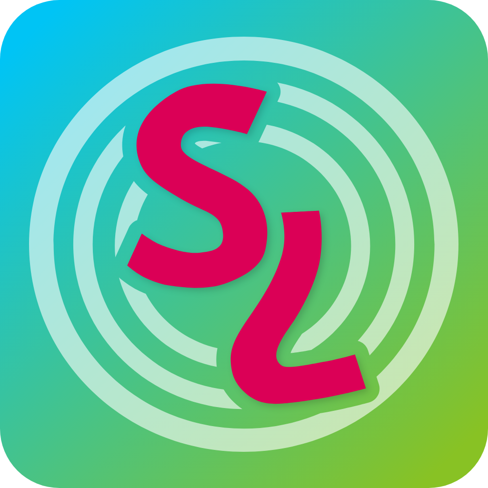

<h1 align="center">
    
    <br/>
    Serial Loops
</h1>
<p align="center">
    <a href="https://dev.azure.com/jonko0493/haroohie-private/_apis/build/status%2FSerialLoops-Official?branchName=main">
        
    </a>
    <a href="https://discord.gg/nesRSbpeFM">
        
    </a>
    <a href="https://haroohie.club/chokuretsu/serial-loops/docs">
        
    </a>
</p>

**Serial Loops** is a fully-fledged editor for the Nintendo DS game _Suzumiya Haruhi no Chokuretsu_ (The Series of Haruhi Suzumiya).

## Screenshots
<p align="center">
  
  
  
  
</p>

## Authors
### Developers
Serial Loops is developed by:
* [Jonko](https://github.com/jonko0493) &ndash; Systems architect & reverse engineering work
* [William278](https://william278.net) &ndash; UX architect & design work

### Translators
Serial Loops is translated into a variety of langauges thanks to the following contributors:
* Chinese (Simplified/Traditional): [Xzonn](https://xzonn.top) (traditional is auto-generated via [OpenCC](https://github.com/BYVoid/OpenCC))
* Italian: Oropuro_49 and Fuyuko Ayumu
* Japanese: Amelia Chaplin

## Documentation
Documentation for how to use Serial Loops can be found on [our website](https://haroohie.club/chokuretsu/serial-loops/).

## Installation
### Prerequisites
#### A Nintendo DS Emulator
To test the game easily, you will want to have a Nintendo DS emulator installed. We recommend using [melonDS](https://melonds.kuribo64.net/) for its accuracy.

#### Installing devkitARM
[devkitARM](https://devkitpro.org/wiki/Getting_Started) is required to use Serial Loops on all platforms.

* Using the Windows graphical installer, you can simply select the devkitARM (Nintendo DS) workloads
* On macOS and Linux, run `sudo dkp-pacman -S nds-dev` from the terminal after installing the devkitPro pacman distribution.

#### Installing Make or Docker
To assemble ASM hacks you want to apply, you will need to decide whether to use Make or Docker. Make is automatically installed when using the Debian and RPM
packages we distribute, so you don't need to worry about this step if you're using either of those.

Currently, the Docker path is **only supported on Windows** due to operating system and framework limitations. It is possible to get Docker running
just fine on Linux distros by running SerialLoops as root (e.g. `sudo SerialLoops`), but it's easier to just use Make. On macOS, there is no known
way of getting the Docker path to work, so you will have to use Make.

* [Make](https://www.gnu.org/software/make/) is the software used to assemble assembly hacks. Installing Make allows you to build the hacks
  directly on your system.
    - To install on Windows, you will have to use a terminal and a package manager. Your options are Winget (installed by default on Win10+) or
      [Chocolatey](https://chocolatey.org/). Open an admin PowerShell or Terminal window (Winkey + X + A) and enter `winget install GnuWin32.make`
      for Winget or `choco install make` for Chocolatey. If using Winget, you will then have to go into system preferences and add Make to the path.
    - Installation on macOS can be done through Xcode or Homebrew. If using Xcode, open a terminal and type `xcode-select --install`. If you would
      rather use Homebrew, open a terminal after installing Homebrew and type `brew install make`.
    - Make comes preinstalled on many Linux distributions, and if you're using the Debian or RPM package, it was definitely installed when you installed
      Serial Loops. If you're using the tar.gz it is not installed on yours, you will likely be able to install it as simply as
      `[packagemanger] install make` from a terminal.
  
  To test if make is installed properly, type `make --verison` into a terminal and see if it produces the version of make.
* If you would rather not install Make, or if it is not working properly, you can instead run it through a Docker container. To do this, you should
  install [Docker Desktop](https://www.docker.com/products/docker-desktop/) or the Docker Engine. Ensure the Docker engine is running and make sure
  to check the "Use Docker for ASM Hacks" option in Preferences. You may want to occasionally clean up containers created by Serial Loops, as it will
  create many of them.
    - On Windows, you will additionally need to install [Windows Subsystem for Linux (WSL)](https://learn.microsoft.com/en-us/windows/wsl/install).
      From an admin PowerShell or Terminal window (Winkey + X + A), simply type `wsl --install` to install it.

#### Installing OpenAL (Linux)
If you're running on Linux and _not using one of the package releases_ (the `.deb` or `.rpm`), you will also need to install OpenAL which is used for audio processing.

### Download & Install
Once you have installed any necessary prerequisites, to install Serial Loops, download the latest release for your platform from the [Releases tab](https://github.com/haroohie-club/SerialLoops/releases).

Be sure to [read the Serial Loops documentation](https://haroohie.club/chokuretsu/serial-loops/docs) for instructions on how to use it!

## Bugs
Please file bugs in the Issues tab in this repository. Please include the following information:
* The platform you are running Serial Loops on
* The version of the _Chokuretsu_ ROM you are using (Japanese, patched English ROM, etc.)
* A description of the steps required to reproduce the issue
* The relevant logs for the issue (can be found in ~/SerialLoops/Logs)

## Development
### License
Serial Loops is licensed under the GPLv3. See [LICENSE](LICENSE) for more information.

### Building
Serial Loops requires the .NET 8.0 SDK to build. You can download it [here](https://dotnet.microsoft.com/download/dotnet/8.0). To build Serial Loops for your platform, run:

```bash
dotnet build src/PLATFORM
```

Remember to replace `PLATFORM` with the platform you're on:
* `SerialLoops.Gtk` for Linux
* `SerialLoops.Mac` for macOS
* `SerialLoops.Wpf` for Windows

We recommend [Visual Studio 2022](https://visualstudio.microsoft.com/) on Windows or [Rider](https://www.jetbrains.com/rider/) on Linux/Mac for development. If you'd like to contribute new features or fixes, we recommend [getting in touch on Discord first](https://discord.gg/nesRSbpeFM) before submitting a pull request!

### Testing
The `SerialLoops.Tests` project can be run from inside Visual Studio, Rider, or with `dotnet test` as normal. However, our UI tests (currently only runnable on Windows) are a bit more involved.

Our UI tests rely on [Appium](https://appium.io/).
#### macOS
1. You will need to install nodejs and then use it to [install Appium](https://appium.io/docs/en/2.4/quickstart/install/).
  - The easiest way to install nodejs is to first install [nvm](https://github.com/nvm-sh/nvm) and then run `nvm install <version>` followed by `nvm use <version>` (you can use `16` as the version)
2. You will then need to install the Mac2 driver with `appium driver install mac2`
3. Follow [these instructions](https://github.com/appium/appium-mac2-driver?tab=readme-ov-file#requirements) for installing and setting up the necessary prerequisites for the Mac2 driver to work

Once you've installed the prerequisites, build the `SerialLoops.Mac` and `SerialLoops.Mac.Tests` projects with `dotnet build src/SerialLoops.Mac/SerialLoops.Mac.csproj` and `dotnet build test/ui/SerialLoops.Mac.Tests/SerialLoops.Mac.Tests.csproj`,
respectively. Then, inside `test\ui\SerialLoops.Mac.Tests\bin\Debug\net8.0`, create a new text file called `ui_vals.json`. Inside this file, place the following text, replacing necessary values:
```json
{
    "AppLoc": "PATH/TO/Serial Loops.app",
    "ProjectName": "MacUITest",
    "RomLoc": "PATH/TO/HaruhiChokuretsu.nds",
    "ArtifactsDir": "PATH/TO/artifacts"
}
```
The artifacts directory can be any arbitrary directory, but ensure it exists before running the tests. The project name by default is WinUITest, but it can be anything you'd like. Have fun.

Finally, you can then run the tests with `dotnet test test\ui\SerialLoops.Mac.Tests\SerialLoops.Mac.Tests.csproj`. However, it may be better to run `appium` from a different terminal first so you
can see the server output as well.

#### Windows
1. You will need to install nodejs and then use it to [install Appium](https://appium.io/docs/en/2.4/quickstart/install/).
  - The easiest way to install nodejs is to first install [NVM for Windows](https://github.com/coreybutler/nvm-windows) and then run `nvm install latest` followed by `nvm use latest` (you can sub latest for any version)
2. You will then need to install the [Appium Windows Driver](https://github.com/appium/appium-windows-driver) with `appium driver install --source=npm appium-windows-driver`.
3. Next, download and install [WinAppDriver](https://github.com/microsoft/WinAppDriver).

Once you've installed all the prerequisites, build the `SerialLoops.Wpf` and `SerialLoops.Wpf.Tests` projects from Visual Studio or with `dotnet build src\ui\SerialLoops.Wpf\SerialLoops.Wpf.csproj` and
`dotnet build test\ui\SerialLoops.Wpf.Tests\SerialLoops.Wpf.Tests.csproj`, respectively. Then, inside `test\ui\SerialLoops.Wpf.Tests\bin\Debug\net8.0`, create a new text file called `ui_vals.json`.
Inside this file place the following text, replacing necessary values:
```json
{
    "AppLoc": "PATH\\TO\\SerialLoops.exe",
    "ProjectName": "WinUITest",
    "WinAppDriverLoc": "PATH\\TO\\WinAppDriver.exe",
    "RomLoc": "PATH\\TO\\HaruhiChokuretsu.nds",
    "ArtifactsDir": "PATH\\TO\\artifacts"
}
```
Ensure you escape your backslashes (`\\` rather than `\`). WinAppDriver is usually installed to `C:\Program Files (x86)\Windows Application Driver\WinAppDriver.exe`. The artifacts directory can
be any arbitrary directory, but ensure it exists before running the tests. The project name by default is WinUITest, but it can be anything you'd like. Have fun.

Finally, you can then open the solution inside Visual Studio and run the tests from the Test Explorer. Alternatively, running `dotnet test test\ui\SerialLoops.Wpf.Tests\SerialLoops.Wpf.Tests.csproj`
may also work.